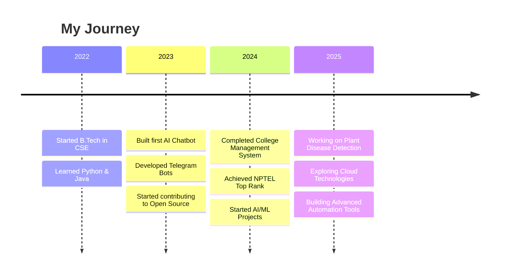

<div align="center">

# 🦅 EagleJat - Full Stack Developer & AI Innovator


[](https://github.com/Eaglejat)
[](https://github.com/Eaglejat?tab=followers)
[](https://github.com/Eaglejat)


</div>

---

## 👨‍💻 About Me


```yaml
name: Vipul Chaudhary
role: Computer Science Engineering Student
location: Gujarat, India 🇮🇳
education: B.Tech in Computer Science
specialization:
  - Artificial Intelligence
  - Automation & Scripting
  - Full Stack Development
  - Computer Vision
current_focus: Building AI-Powered Solutions
passion: Creating technology that makes impact
motto: "Code with purpose, innovate with passion"
```

<br>

🔭 **Currently Building:** AI-powered Plant Disease Detection System  
🌱 **Currently Learning:** Advanced ML Algorithms, Cloud Architecture & Microservices  
👯 **Open to Collaborate:** AI/ML Projects, Open Source Contributions  
💬 **Ask Me About:** Python, AI/ML, Telegram Bots, Web Development, Automation  
📧 **Reach Me:** [vipul_22048@ldrp.ac.in](mailto:vipul_22048@ldrp.ac.in)  
⚡ **Fun Fact:** I automate everything - even my coffee brewing schedule! ☕

---

<div align="center">

## 🛠️ Tech Stack & Tools


</div>

### 💻 Languages
<div align="center">


</div>

### 🚀 Frameworks & Libraries
<div align="center">


</div>

### 🗄️ Databases & Cloud
<div align="center">


</div>

### 🔧 Tools & Platforms
<div align="center">


</div>

---

## 🌟 Featured Projects

<div align="center">

<table>
<tr>
<td width="50%" valign="top">

### 🤖 AI Chatbot Ecosystem


**🎯 Highlights:**
- 🔥 **4-5 Production-Grade AI Chatbots**
- 🧠 Advanced NLP & Deep Learning
- 💬 Context-aware conversations
- 🌐 Multi-platform deployment
- 📊 Real-time analytics dashboard
- 🔄 Continuous learning capabilities

**Tech Stack:** Python, TensorFlow, NLTK, Rasa, FastAPI

</td>
<td width="50%" valign="top">

### 📱 Telegram Bot Suite


**🎯 Highlights:**
- ⚡ **2-3 High-Performance Bots**
- 🤖 Task automation & scheduling
- 📈 Analytics & reporting features
- 🔐 Secure API integrations
- 🎨 Rich interactive interfaces
- ☁️ Cloud-deployed & scalable

**Tech Stack:** Python, python-telegram-bot, Redis, Docker

</td>
</tr>

<tr>
<td width="50%" valign="top">

### 🌱 Plant Disease Detection AI


**🎯 Highlights:**
- 🔬 **AI-Powered Disease Detection**
- 📸 Image processing & classification
- 🎯 94%+ accuracy on test data
- 🌐 Web-based interface (React)
- 📱 Mobile-responsive design
- 🗂️ Disease database with remedies

**Tech Stack:** TensorFlow, OpenCV, Flask, React, MongoDB

</td>
<td width="50%" valign="top">

### 🎓 College Management System


**🎯 Highlights:**
- 📚 **Complete Administration Solution**
- 👥 Student & faculty management
- 📊 Performance tracking & analytics
- 🔐 Role-based access control
- 📅 Attendance & timetable system
- 💾 Secure data management

**Tech Stack:** React, Node.js, Express, MongoDB, JWT

</td>
</tr>
</table>

</div>

---

## 🏆 Achievements & Certifications

<div align="center">

<table>
<tr>
<td align="center" width="25%">

<br><b>NPTEL Java</b>
<br>Top Rank Holder
</td>
<td align="center" width="25%">

<br><b>AI Projects</b>
<br>4+ Completed
</td>
<td align="center" width="25%">

<br><b>Automation Bots</b>
<br>3+ Deployed
</td>
<td align="center" width="25%">

<br><b>Open Source</b>
<br>Active Contributor
</td>
</tr>
</table>

### 📜 Certifications
- 🥇 **NPTEL Java Programming** - Elite Grade
- 🎓 **Computer Science Engineering** - B.Tech (In Progress)
- 🤖 **Machine Learning Specialization** - Coursera
- 🐍 **Python for Data Science** - IBM
- ☁️ **Cloud Computing Fundamentals** - AWS

</div>

---

## 📊 GitHub Statistics

<div align="center">


</div>

### 📈 Contribution Graph
<div align="center">

[](https://github.com/Eaglejat)

</div>

### 🏆 GitHub Trophies
<div align="center">

[](https://github.com/ryo-ma/github-profile-trophy)

</div>

---

## 💼 Professional Experience

<div align="center">



</div>

---

## 🎯 Skills Proficiency

<div align="center">

| **Category** | **Skills** | **Proficiency** |
|:---|:---|:---:|
| **Programming** | Python, Java, JavaScript |  |
| **AI/ML** | TensorFlow, PyTorch, OpenCV |  |
| **Web Development** | React, Node.js, Flask |  |
| **Databases** | MongoDB, MySQL, PostgreSQL |  |
| **DevOps** | Docker, Git, Linux |  |
| **Automation** | Telegram Bots, Scripting |  |

</div>

---

## 🎮 Beyond Coding

<div align="center">

<table>
<tr>
<td align="center" width="25%">

<br><b>🌐 Networking</b>
<br>Exploring protocols
<br>& architectures
</td>
<td align="center" width="25%">

<br><b>🎯 Gaming</b>
<br>Strategic thinking
<br>& problem solving
</td>
<td align="center" width="25%">

<br><b>🤖 AI Research</b>
<br>Latest trends
<br>& innovations
</td>
<td align="center" width="25%">

<br><b>🛠️ Automation</b>
<br>Smart solutions
<br>for daily tasks
</td>
</tr>
</table>

</div>

---

## 🤝 Let's Connect!

<div align="center">

<a href="https://linkedin.com/in/vipul__j_a_a_t">
  
</a>
<a href="https://instagram.com/vipul__j_a_a_t">
  
</a>
<a href="mailto:vipul_22048@ldrp.ac.in">
  
</a>
<a href="https://github.com/Eaglejat">
  
</a>
<a href="https://twitter.com/vipul_jaat">
  
</a>

<br><br>

📧 **Email:** [vipul_22048@ldrp.ac.in](mailto:vipul_22048@ldrp.ac.in)  
💼 **LinkedIn:** [vipul__j_a_a_t](https://linkedin.com/in/vipul__j_a_a_t)  
📸 **Instagram:** [@vipul__j_a_a_t](https://instagram.com/vipul__j_a_a_t)

</div>

---

<div align="center">

### 💭 Developer Quote of the Day


### 🎵 Spotify Playing
[](https://open.spotify.com/user/YOUR_SPOTIFY_ID)

### ☕ Support My Work
[](https://buymeacoffee.com/eaglejat)

---


<br>

**⭐ If you find my work interesting, consider starring my repositories!**

<br>


<br>


**© 2026 EagleJat | Built with ❤️ and ☕**

</div>
